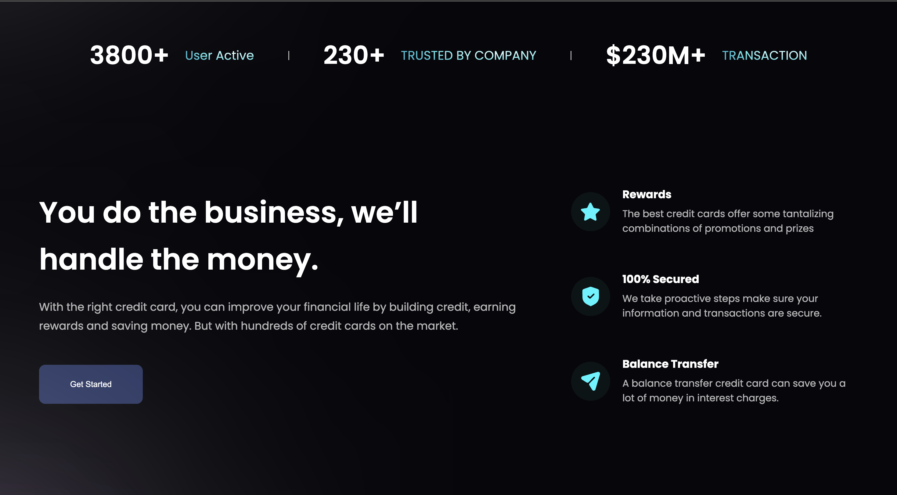

# Welcome!👋

# Hoobank

Hoobak is a responsive web application built using React.js, HTML, and CSS. It provides an amazing user interface and design.





## Demo

You can try out the live demo of the ToDo App [here](https://www.example.com)

## Features

- Fully responsive design
- Smooth animations
- Easy-to-use navigation

## Installation

1. Clone the repository:

   ```bash
   git clone https://github.com/your-username/hoobak.git

2. Navigate to the project directory: cd Hoobank

3. Install the dependencies: npm install

4. Start the development server: npm start

5. Open your browser and visit http://localhost:3000 to see the HooBank.

## Technologies Used

1. React.js
2. HTML
3. CSS
4. TypeScript

## Contact 

or any inquiries or questions, feel free to contact [Mariami] at [gogaladzemariam8@gmail.com].